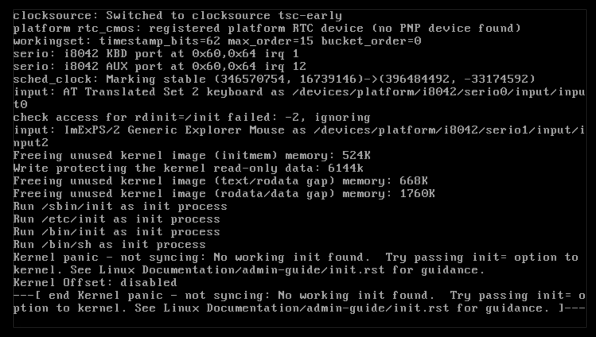
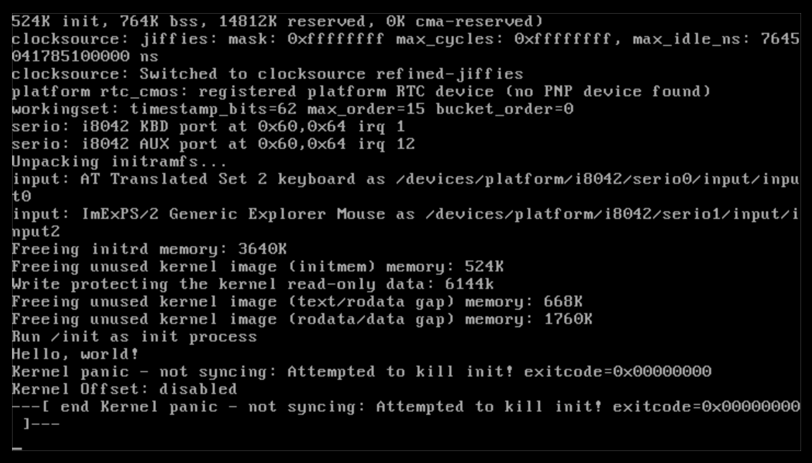

# Booting the Kernel

This is surprisingly relatively simple! However, it is very finickey, so be sure to follow the instructions below
precisely to end up with a working result.

```admonish tip title="Restarting"
If you feel that you have messed around a lot and nothing's matching up with what it should be, the
command `make mrproper` will revert your linux directory back to what it was when you first cloned it.
```

## Compiling the Kernel

First, to boot the kernel, we need to compile the kernel! The kernel is very customizable,
and, for now, we don't need all of its features, so enter the Linux directory and
run `make tinyconfig`. This creates a basic configuration that we can now edit with
`make menuconfig`.

Now, follow these instructions:
 - Enable **Device drivers → character devices → TTY**
 - Enable **General setup → configure standard kernel features (expert users) → printk support**
 - Enable **64-bit kernel**
 - Enable **General setup → initramfs support**
   - Disable all the compression options except gzip, since that is the compression tool that we will be using.
 - Enable **Executable file formats → ELF binaries** and **Executable file formats → scripts starting with #!**

For now, this is the configuration that we will be using. Save your changes by exiting.

Compile with make; recall that you can use multiprocessing to speed up compilation. Now, just to test things out,
run the kernel with qemu by running `qemu-system-x86_64 -kernel arch/x86_64/boot/bzImage`; there should be some
output and then you should see a screen like this:



### So what did we just do?

`tinyconfig`, as mentioned before, gives us the bare minimum we need to boot the kernel. This lets us compile it
pretty fast and customize it to do what we want. However, it leaves a lot of stuff out.

For starters, by default, it doesn't come with *TTY* drivers. Since a TTY is basically the terminal, without this
driver, the kernel wouldn't be able to print anything out!

We'd also probably like some sort of debugging tool that's telling us what's going on; this tool is `printk`.
`printk` is essentially a C function similar to `printf`; it is slightly different and is modified for the
kernel's purposes. You can actually see the kernel's output on your own computer with the `dmesg` command!
This command reads the `/dev/kmsg` device, where the kernel outputs its logs, and prints it out for you.

Finally, since most devices are 64 bit, it makes sense to compile a 64 bit kernel since otherwise, we would
not be able to move binaries from the host computer into the VM without the use of a cross-compiler,
which is, frankly, a pain.

What about the other options? Well, we'll see soon enough!

## Initrd

If you read the error message, you'll find that the kernel's saying that it can't find an init. *init* is
the first process that is run on a linux system; it has the process identifier (PID) of 1. In fact, you can
find that process on your own computer: `ps --pid 1` yields the init process on your computer. On most modern
computers, this should be `systemd`.

Our simple linux computer, however, lacks an init program (not technically true, but we'll get into this in the
next chapter)! Let's make a simple init program: navigate into your filesystem root directory, and create the
following file at the root of that directory with the name `init`:

```bash
#!/bin/sh
echo "Hello, world!"
```

Run `chmod +x init` to make it an executable (this was why we enabled the kernel option to recognize scripts
starting with a hashbang as executables).

Now that we have this init file, how do we actually let the kernel load it? We have to turn it into an
*initramfs*: an *init*ial *ram* filesystem.

```admonish question title="What is an initramfs?"
Although in this tutorial, we have complete knowledge about the (virtualized) hardware we are running
our OS on, OS images targetted at a wider range of people have to remain adaptable to the presence of different
hardware: depending on what devices are detected, different drivers will be loaded.

Placing this logic in the kernel code is inelegant and hard to maintain. Instead, an initramfs is created
to contain all the tools that may be needed, and the kernel is booted with access to the initramfs; then,
normally written code, like a shell script or an executable, can detect hardware and load the necessary
modules.

The normal boot procedure of a Linux system will be covered later, but, for now, all that you need to
know is that an initramfs offers a convenient way of providing a root filesystem, but it doesn't
offer a means of actually interacting with any hardware.

Here, we will be manually creating an initramfs, or an *initrd* (initial ramdisk), but there are
other tools such as `dracut` and `mkinitcpio`.
```

An initramfs is a variety of *cpio* archive; think of it as a program like tar. cpio takes a bunch of paths
as input and prints out the archive on its output. We'll also be compressing it, as a good practice; strictly,
this shouldn't be necessary, but as the filesystem grows, it is beneficial to keep the size of the archive lower.
As stated above, we'll be using gzip.

To perform these tasks, run the following command in the filesystem root:
```bash
find . | cpio --create --verbose --format=newc | gzip --best > ../initrd
```
The format argument passed to cpio basically tells it to use the new version of the cpio file format.

Now, we have an initrd file in the parent folder, and all that remains is booting the kernel with this initial
filesystem!

## Running our shell

This step is the simplest of them all if you've been following along correctly! With qemu being installed,
run:
```bash
qemu-system-x86_64 -kernel path/to/bzImage -initrd path/to/initrd
```
If all goes well, you should see something like this:



If you see a "Hello, world!" in your output, congratulations! You've pretty much built a
minimal system! All you need to do to get a shell is to replace that `echo "Hello, world!"`
line in the init file with something like `sh`, recreate the cpio archive,
and you'll be good to go!

If you can do this successfully, great! Our minimal system is done. But this was probably
less educational than you hoped: if you're like me, you've probably never even interacted
with any of these tools or components of your operating system!

Don't worry: right now,
we're starting out at the bottom level. As we begin to climb out, more things will start
to seem familiar! So let's start the ascent!
