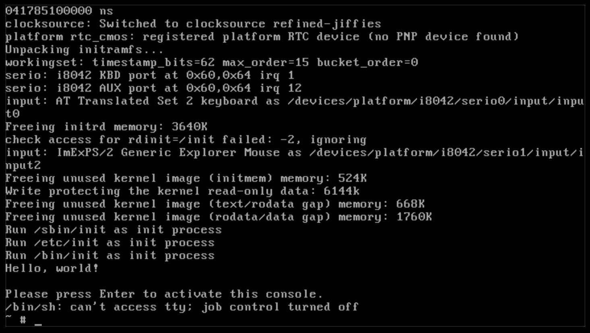

# An Init System

As I mentioned before, the init process is the first process started by the Linux kernel;
most modern computers use systemd for this, and we will too, later in this book. For now,
however, we will be using Busybox's built-in init system.

```admonish note title="Init system considerations"
This book is meant to show current practices; this is why systemd will be shown in the
future. That being said, systemd has been criticized for not adhering to the Unix
philosophy: that each tool should do one thing, and do it well; instead, critics
claim that systemd handles too many tasks at the same time.

Personally, I dislike how systemd obscures what exactly is going on: systemd is
managed through commands like `systemctl` instead of editing files, as we'll see,
and logs are viewed through `journalctl` instead of just viewing files. That
being said, systemd is used for its extensive parallization capabilities and
versatility.

Although we will be using Busybox's init system, note that the following syntax
is also used by most of systemd's competitors, including OpenRC (used by Alpine and
Gentoo) and runit (Void).
```

The primary advantage of using an init system over a simple shell script is that init
systems generally possess the capability to run multiple tasks at the same time,
run tasks at particular.

If you looked in the `bin` folder, you'd have found another `init` program; if you
switch into a chroot environment or enter the VM and run init, you'd run into
an error: `init: must be run as PID 1`. If you run `init -h`, you helpfully
see that "It (re)spawns children according to /etc/inittab." So, let's take a
look at the format of `/etc/inittab`.

## Inittab

The inittab file consists of multiple lines with the following format:

```
id:runlevel:action:process
```

Let's explain each of these fields:
- id: in busybox, this refers to the tty that the service will run on. For us, we
  will keep it blank so that it refers to `/dev/console`, or the default
- runlevel: a runlevel is essentially a state that the computer is operating in;
  for example, runlevel 0 is powered off, 1 is single user mode, 6 is reboot,
  and there are others. Busybox does not support runlevels, so this will also
  be blank.
- action: this is an event that the operating system will give us. Some available
  actions are: `sysinit`, `askfirst` (which will ask the user first), `shutdown`,
  and `ctrlaltdel` (which fires on ctrl-alt-delete)
- process: this is the actual process that will be run.

In a lot of cases, it is preferable to write a script instead of directly running
a binary from the inittab; these scripts are stored in the `/etc/init.d` directory.
Let's write a basic init! We will be revising some of the stuff we do here in
subsequent chapters.

## A basic inittab

Make the `etc` folder in your filesystem root, and there,
place this inittab into `/etc/inittab`:
```inittab
::sysinit:/etc/init.d/rcS   # Initialize system
::askfirst:/bin/sh          # Start shell when user presses enter
```

Now, make the directory `init.d` and make the new file `rcS`: this is the standard
name for the file that initializes the system. In it, let's just place a simple
hello world message:

```bash
#!/bin/sh

echo "Hello, world!"
```

`chmod +x rcS`, delete our old init file, and pack the entire directory into an initramfs, then boot the kernel
as before. Now, you should see "Hello, world!" and a prompt that says "Please press Enter to activate this
console"; if you press enter, you should see something like this:



If so, hurray! We've just started setting the basic building blocks towards our
final Linux system!

Next, we're going to put the init system to actual use by mounting (pseudo)-filesystems.
